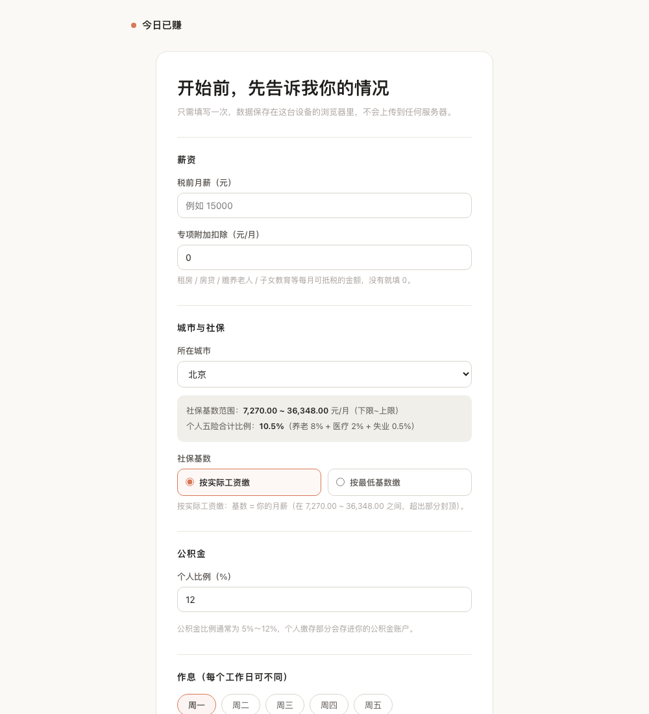
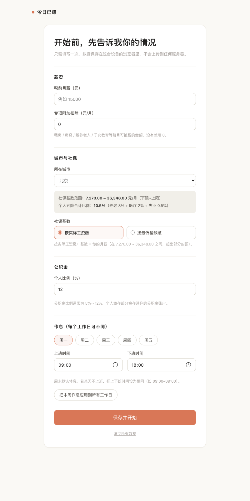

# 今日已赚 ⏱️

> 一个看着"时间 = 金钱"的上班计时器。打开页面，看着数字每秒跳动，感受时间在替你赚钱。

纯静态单文件网页，无任何后端、无外部依赖、数据只保存在你自己的浏览器里。可部署为 PWA，手机"添加到主屏幕"即可像 App 一样使用。

## ✨ 功能

- **每秒跳动的大数字**：今日已赚金额实时滚动更新（odometer 翻页效果），到点下班有庆祝动效 🎉
- **实时速率**：本秒 +¥x · 时薪 ¥x · 日薪 ¥x
- **智能状态识别**：工作中 / 还没上班 / 已下班 / 休息日 / **法定节假日**，自动切换
- **法定节假日自动识别**：内置 2026 年国务院放假安排，调休补班的周末自动按上班日计算
- **每日不同作息**：周一到周五可单独设置上下班时间
- **按城市计算到手工资**：内置主要城市社保基数参数，自动计算税后到手（累计预扣个税）
- **收入明细**：一键查看"你的钱去哪了"——五险一金、个税逐项拆解
- **本月目标**：设置到手目标，绿色进度条追踪
- **发薪日倒计时**：每月发薪日倒计时，当天有庆祝提示
- **趣味换算**：今天的工作 ≈ 几顿火锅 · 几杯咖啡
- **每日记录 + 月度热力图**：每天收入自动记录（仅存本机），热力图一眼看本月
- **今日战绩分享卡**：一键生成精美卡片图，可保存 / 分享
- **暗色模式**：一键切换，默认跟随系统
- **数据完全本地**：设置与记录存于浏览器 localStorage，不上传任何服务器

## 🖼️ 界面

| 主页面 | 设置页（含热力图） |
|---|---|
|  |  |

## 🚀 使用

打开 `index.html` 或访问在线地址，首次进入设置页：

1. **税前月薪**：必填
2. **城市**：选择后自动带出该城市社保基数范围（个人五险合计比例）
3. **社保基数**：按实际工资缴 或 按当地最低基数缴（直接影响到手金额）
4. **公积金个人比例**：5% ~ 12%
5. **专项附加扣除**：租房 / 房贷 / 赡养老人等每月抵税金额（没有填 0）
6. **本月目标 / 发薪日**：可选，填 0 关闭
7. **作息**：周一到周五各自的上下班时间（某天不上班就设成相同时间）

保存后即可看到主页面，之后每次打开直接显示。

## 🧮 计算逻辑

```
到手工资 = 税前月薪 − 个人五险一金 − 个人所得税（累计预扣法，七级累进税率）
时薪     = 平均月到手 ÷ 21.75 计薪日 ÷ 每日计薪时长
今日已赚 = 时薪 × 今日已工作秒数
```

> 社保基数上下限为各城市可查到的官方/权威数值（随年度调整），仅供参考，实际以工资条为准。

## 🛠️ 技术

- 单文件 HTML（HTML + CSS + 原生 JS）+ PWA（manifest + Service Worker 离线缓存）
- odometer 翻页数字效果：每个数字独立滚动轮，进位时多列同时滚动
- 响应式设计，手机 / 桌面均可用
- 兼容 Chrome / Edge / Safari 等现代浏览器

## 🌐 在线地址

https://bin-deng-666.github.io/today-earning/

手机浏览器打开后，可用"添加到主屏幕"安装为 App。

## 📄 License

[MIT](LICENSE)
